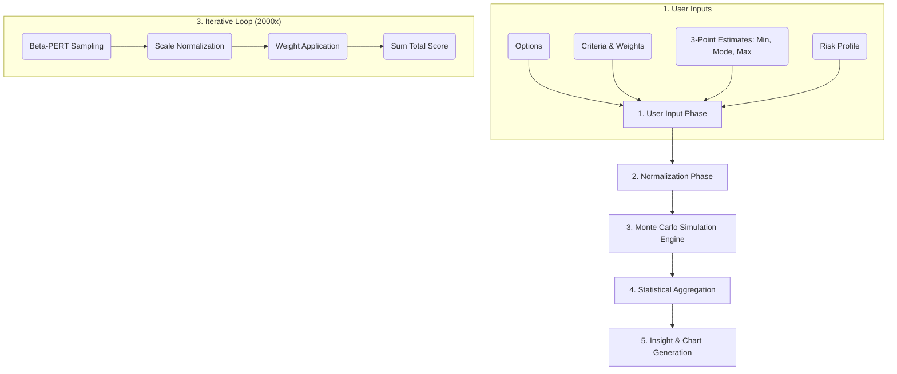

# Decision Coach: Mathematical & Logical Flow Architecture

This document breaks down the exact logic, mathematical models, and data flow powering the Decision Coach engine. It transforms subjective human estimates into statistically rigorous decision intelligence.

---

## 1. The Logical Flow Architecture

The engine processes data in a strict 5-stage pipeline:

---

## 2. Step-by-Step Mathematical Analysis

### Phase 1: User Inputs & 3-Point Estimation
Instead of asking for a single "guess," the engine asks for a **Worst-case ($min$)**, **Most Likely ($mode$)**, and **Best-case ($max$)** scenario for every variable. This captures *uncertainty*.

### Phase 2: Normalization
Before the simulation runs, the engine prepares the playing field.
1. **Weight Normalization:** 
   If a user sets weights of 50, 50, and 100, they are normalized to sum to $1.0$: $(0.25, 0.25, 0.50)$.
2. **Global Bounds Mapping:**
   For a criterion like "Salary", the engine finds the absolute lowest minimum and absolute highest maximum across *all* options to create a universal scale.

### Phase 3: The Monte Carlo Simulation Engine
The engine runs $N = 2000$ parallel universes (iterations). In each universe, it calculates a final score for every option.

#### A. Beta-PERT Sampling
For every variable, instead of picking a uniform random number, we use the **Beta-PERT Distribution**. This heavily favors the "Most Likely" value but allows for long tails towards the extremes.
*   **Mean ($\mu$):** $\frac{min + 4 \times mode + max}{6}$
*   **Standard Deviation ($\sigma$):** $\frac{max - min}{6}$

We convert these into $\alpha$ and $\beta$ shape parameters to draw a random sample $X$ from a statistical Beta Distribution.

#### B. Scale Normalization (0 to 1)
Because you cannot add "Dollars" to "Minutes of Commute," every sampled value $X$ is converted into a generic "utility score" between 0 and 1.
*   **If Higher is Better:** $Score = \frac{X - GlobalMin}{GlobalMax - GlobalMin}$
*   **If Lower is Better:** $Score = 1 - \left( \frac{X - GlobalMin}{GlobalMax - GlobalMin} \right)$

#### C. Final Score Calculation
The final score for Option $i$ in a given iteration is the sum of its normalized scores multiplied by the normalized weights.
$$TotalScore_i = \sum (NormalizedScore_{ij} \times Weight_j)$$

---

## 4. Statistical Aggregation

After 2,000 universes have been simulated, we have a massive dataset of 2,000 possible final scores for each option. The engine calculates:

1. **Expected Value (Mean):** The average score across all iterations.
2. **Win Probability:** 
   $$ Win\% = \frac{\text{Iterations where Option A had the highest score}}{2000} $$
3. **Volatility & Risk Metrics:**
   *   **Downside Risk:** The probability that the score falls more than 1 Standard Deviation *below* the mean.
   *   **Upside Potential:** The probability that the score falls more than 1 Standard Deviation *above* the mean.
4. **Regret Minimization:** 
   In every iteration, we calculate how far behind the "winner" an option was. The average of these losses is the "Expected Regret."

### Risk Utility Transformations
If the user selects a specific Risk Profile, the raw scores are bent using Utility Theory before averaging:
*   **Risk Averse (Logarithmic):** Diminishing returns. Ensures that a small guaranteed win is valued higher than a massive but unlikely win. $U(x) = \frac{\ln(1 + 9x)}{\ln(10)}$
*   **Risk Seeking (Quadratic):** Exponential returns. Punishes mediocrity and heavily rewards massive upside potential. $U(x) = x^2$

---

## 5. Decision Logic & Insights

Finally, the engine uses Boolean logic to translate the math into English sentences (the "Human Take"):
*   **Confidence Logic:** If $WinProbability > 75\%$, return "High Confidence". If $< 55\%$, return "Low Confidence."
*   **Bias Warning:** If any single criterion holds $> 50\%$ of the total weight, flag it as a biased decision.
*   **Variance Warning:** If the standard deviation of an option is $> 30\%$ of its mean, flag it as highly volatile/risky.
